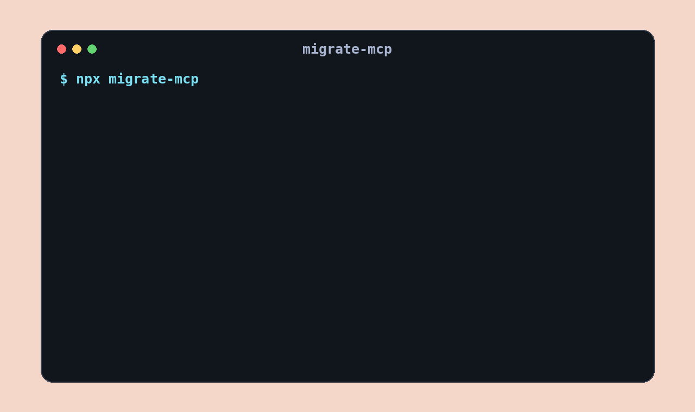

# migrate-mcp

> Inspect, explain, and prepare database migrations without giving an agent permission to run them.

`migrate-mcp` is an open-source MCP server for Alembic, golang-migrate, TypeORM, Sequelize, and Prisma. It detects frameworks from repository evidence, inspects migration state and drift through framework-native commands, reviews risk, generates files with explicit approval, explains changes, and gives rollback guidance.

It deliberately exposes no tool that applies a migration or executes a rollback.

## 30-second setup

Add this server to your MCP client:

```json
{
  "mcpServers": {
    "migrate": {
      "command": "npx",
      "args": ["-y", "migrate-mcp"]
    }
  }
}
```

Then ask: `Detect the migration framework in this repo and review the pending migration.`



## Tools

| Tool | Purpose | Writes files |
| --- | --- | --- |
| `detect_migration_frameworks` | Detect supported frameworks with evidence | No |
| `list_migration_status` | Inventory migrations and query status where configured | No |
| `detect_schema_drift` | Run verified framework-native drift checks | No |
| `review_migrations` | Find destructive, availability, data, and rollback risk | No |
| `generate_migration` | Generate through the framework CLI after approval | Yes |
| `explain_migration` | Explain recognized operations in plain English | No |
| `get_rollback_guidance` | Describe rollback steps and uncertainty | No |

## Safety model

- No apply, upgrade, deploy, rollback, or downgrade execution tools.
- Generation requires `approved: true`, validates the name, and blocks production-like targets.
- Commands use argument arrays with `shell: false`, bounded output, timeouts, and a small environment allowlist.
- Paths are resolved against a real repository root and symlink escapes are rejected.
- Credentials are redacted from diagnostics.
- Unsupported capabilities return an explicit unsupported or partial result instead of guessed output.

Generation can still execute project-owned framework configuration, so review repositories before granting an agent access.

## Framework support

| Framework      | Detect | Status         | Drift       | Generate     | Review and explain |
| -------------- | ------ | -------------- | ----------- | ------------ | ------------------ |
| Alembic        | Yes    | CLI-backed     | CLI-backed  | Autogenerate | Yes                |
| golang-migrate | Yes    | Version-backed | Partial     | Skeleton     | Yes                |
| TypeORM        | Yes    | CLI-backed     | CLI-backed  | CLI-backed   | Yes                |
| Sequelize      | Yes    | CLI-backed     | Unsupported | Skeleton     | Yes                |
| Prisma         | Yes    | CLI-backed     | CLI-backed  | CLI-backed   | Yes                |

Database-backed operations require the same framework configuration and credentials that the project CLI requires. Offline inventory remains available when those are absent.

## Programmatic API

```ts
import { detectMigrationFrameworks, reviewMigrations } from "migrate-mcp";

const frameworks = await detectMigrationFrameworks(process.cwd());
const review = await reviewMigrations({
  repository: process.cwd(),
  paths: ["migrations/20260923_add_accounts.sql"],
});
```

## Development

Requires Node.js 22 or newer.

```bash
npm ci
npm run check
```

See [CONTRIBUTING.md](CONTRIBUTING.md) for fixture and adapter guidelines. Security concerns belong in [SECURITY.md](SECURITY.md).

## License

MIT
